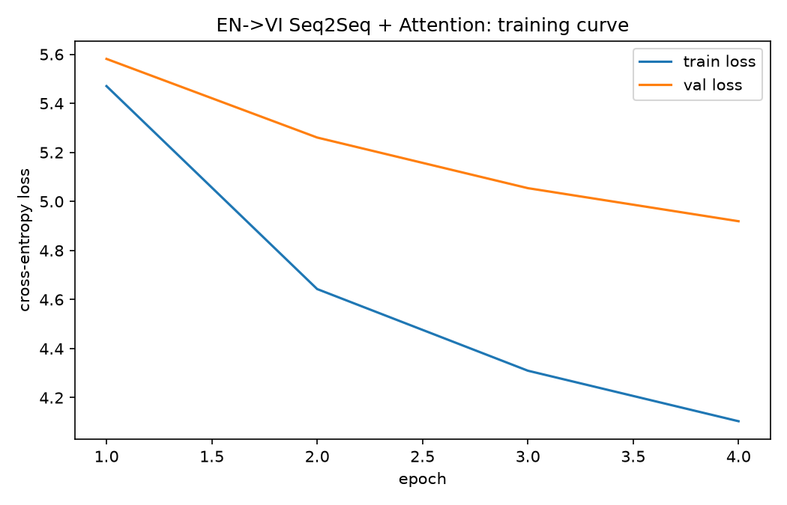

# English -> Vietnamese Neural Machine Translation

[](https://github.com/thevietofficial-coder/en-vi-neural-machine-translation/actions/workflows/tests.yml)

A sequence-to-sequence translator (BiGRU encoder + Bahdanau attention decoder)
trained **from scratch in PyTorch** on the real IWSLT'15 English-Vietnamese
corpus (133,317 TED-talk sentence pairs, Luong & Manning 2015).

> Built to apply the sequence-model concepts from Andrew Ng's *Sequence Models*
> (Coursera, Course 5, Weeks 1&ndash;3) &mdash; RNN/GRU encoders, the attention
> mechanism, encoder-decoder architectures &mdash; on a real bilingual corpus,
> with the model, training loop, and app written independently rather than
> reusing the course's own (much smaller, synthetic date-translation) assignment.

## Why this project

The course's Week 3 assignment applies attention to a toy task: translating
10,000 synthetic human-readable dates ("25th of June, 2009") into a fixed
format. This project keeps the same architecture family but applies it to a
**real** translation problem: 133k naturally-occurring English/Vietnamese
sentence pairs from TED talks, with real vocabulary size (~29k English /
~12.5k Vietnamese word types), variable-length sentences, and a standard
academic benchmark (BLEU) instead of exact-match accuracy.

## Architecture

```
EN sentence -> [Embedding] -> [Bidirectional GRU encoder] -> encoder_outputs (per source token)
                                                                       |
VI token t-1 -> [Embedding] --concat--> [GRU decoder] <-- context_t --[Bahdanau attention]
                                              |
                                       [Linear -> softmax] -> VI token t
```

- **Encoder**: word embeddings -> bidirectional GRU. Source sentences are
  packed with `pack_padded_sequence` so padding never affects the hidden
  state. The concatenated final forward/backward hidden state is projected
  (`tanh(W*h + b)`) into the decoder's initial hidden state.
- **Attention** (`src/model/attention.py`): additive/Bahdanau attention.
  At each decoder step, every encoder position gets a score
  `v^T * tanh(W_enc*h_enc + W_dec*h_dec)`, softmax-normalized over the
  *unpadded* source positions only (via an explicit boolean mask), producing
  a context vector as their weighted sum.
- **Decoder** (`src/model/decoder.py`): GRU driven by `[prev_token_embedding ; context]`,
  trained with teacher forcing (ratio 0.5) and, at inference, greedy decoding
  one token at a time until `<eos>` or `max_len`.
- **Bucketed batching** (`src/data/dataset.py::BucketBatchSampler`): batches
  are built from length-sorted sentences (batch order still shuffled each
  epoch) so a single very long sentence doesn't force padding onto an entire
  batch of otherwise-short ones &mdash; this alone meaningfully cuts CPU
  training time on this dataset.

## Results

Corpus BLEU on the held-out `test` split (1,268 sentence pairs):

**BLEU: TBD** (see `reports/eval_results.json` after running `src/evaluate.py`)

| Metric | Value |
|---|---|
| Train pairs (<=30 tokens both sides) | TBD |
| Validation pairs | TBD |
| Test pairs | 1,268 |
| Trainable parameters | TBD |
| Epochs trained | TBD |
| Final train loss | TBD |
| Final val loss | TBD |
| Test BLEU | TBD |



### Sample translations

| English | Reference (Vietnamese) | Model output |
|---|---|---|
| TBD | TBD | TBD |

### Attention heatmap (from the Streamlit app)

The app visualizes which English words the decoder attended to while
generating each Vietnamese word &mdash; the classic sanity check for whether
attention is actually learning alignment rather than just memorizing.

## Training notes

This environment has an NVIDIA RTX 4060 GPU, but only a CPU-only PyTorch
build (`torch==2.13.0+cpu`) was available to install (the CUDA wheel index
had no matching build for the installed Python 3.14 at training time), so
the model was trained on CPU. To keep CPU training tractable, hidden/embedding
dimensions were kept modest (128 vs. the 512/512 used in the original
Luong & Manning IWSLT15 setup) and sentences were capped at 30 tokens
(see `src/config.py`). With a CUDA build of PyTorch, `EMB_DIM`,
`ENC_HIDDEN_DIM`, and `DEC_HIDDEN_DIM` can be raised back to 512+ and
`MAX_LEN` to 50 for meaningfully higher BLEU, at the cost of longer training.

## Project structure

```
en-vi-neural-machine-translation/
├── app.py                   # Streamlit demo: EN sentence -> VI translation + attention heatmap
├── data/raw/                # train/validation/test parquet (download via src/data/download.py)
├── data/processed/          # saved vocab_en.json / vocab_vi.json
├── models/best_model.pt     # best checkpoint by validation loss
├── notebooks/01_eda.ipynb   # corpus exploration (length distributions, samples)
├── reports/                 # loss curve, BLEU + sample translations (eval_results.json)
├── src/
│   ├── config.py            # paths + hyperparameters
│   ├── data/
│   │   ├── download.py      # fetch the IWSLT'15 EN-VI corpus
│   │   ├── vocab.py         # tokenizer + Vocab (build/save/load)
│   │   └── dataset.py       # TranslationDataset, collate_fn, BucketBatchSampler
│   ├── model/
│   │   ├── encoder.py       # bidirectional GRU encoder
│   │   ├── attention.py     # Bahdanau attention
│   │   ├── decoder.py       # attention-driven GRU decoder
│   │   └── seq2seq.py       # training (teacher forcing) + greedy inference
│   ├── train.py              # training loop, checkpointing, loss curve
│   ├── evaluate.py           # corpus BLEU on the test split
│   └── translate.py          # CLI + Translator class used by app.py
└── tests/                    # vocab, dataset, and model unit tests (pytest)
```

## How to run

```bash
pip install -r requirements-dev.txt

# 1. Download the corpus (IWSLT'15 EN-VI, 133k/1.3k/1.3k train/val/test pairs)
python -m src.data.download

# 2. Train (builds and caches the vocab on first run)
python -m src.train

# 3. Evaluate BLEU on the test set
python -m src.evaluate

# 4. Try it interactively
streamlit run app.py
```

Run the test suite with:

```bash
pytest -v
```

## Dataset

[IWSLT'15 English-Vietnamese](https://nlp.stanford.edu/projects/nmt/data/iwslt15.en-vi/)
(Luong & Manning, *Stanford Neural Machine Translation Systems for Spoken
Language Domain*, IWSLT 2015) &mdash; 133,317 train / 1,268 validation / 1,268
test sentence pairs from TED talk transcripts. The original host blocks
automated downloads, so `src/data/download.py` pulls an identical mirror
hosted as Parquet on HuggingFace (`Nhan2201/iwslt-eng-vi`).

## License

MIT &mdash; see [LICENSE](LICENSE).
